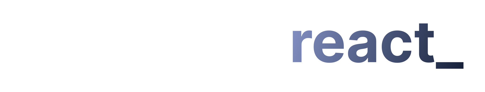

  

## 💻 Projeto

Aplicação desenvolvida durante o evento imersão react_ promovido pela Alura em Nov/2022.

## ✨ Tecnologia

- [React](https://reactjs.org/)
- [NextJS](https://nextjs.org/)
- [styled components](https://styled-components.com/)
- E muitas outras…

## 🚀 Como executar

Em todos os projetos, ao acessar a pasta, é preciso baixar os pacotes com o gerenciador de sua preferencia.

Acesse a documentação de cada projeto:

- [Backend](./server/README.md)
- [Web](./web/README.md)

## 🔖 Layout

Você pode visualizar o layout do projeto através do link abaixo:

- [Layout Figma](https://www.figma.com/file/1acrju7CLwHkSh6e7xEk9h/Aluratube?node-id=0%3A1)

Lembrando que você precisa ter uma conta no [Figma](http://figma.com/).

## 📝 License

Esse projeto está sob a licença MIT. Veja o arquivo [LICENSE](LICENSE) para mais detalhes.

---

  Feito com 💜 by Alura - Repositório original do projeto [AluraTube](https://github.com/alura-challenges/aluratube)

